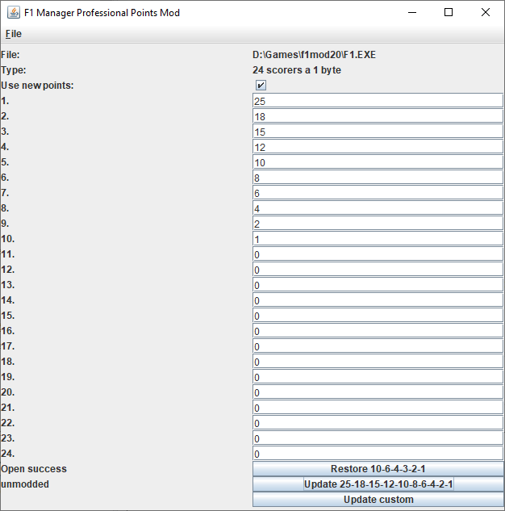
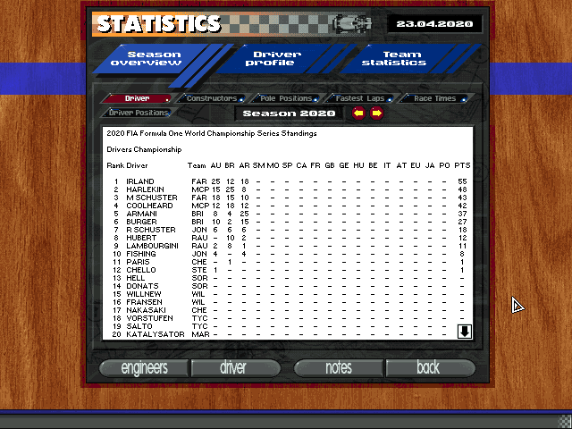

# f1mp-point-system

A small tool to modify the points system in F1 manager professional.

The game stores the point scheme in 6 4-byte integers. With half a dozen modifications it's possible to use that area as 24 1-byte values, which theoretically makes it possible to give points to each driver in the field ^^

